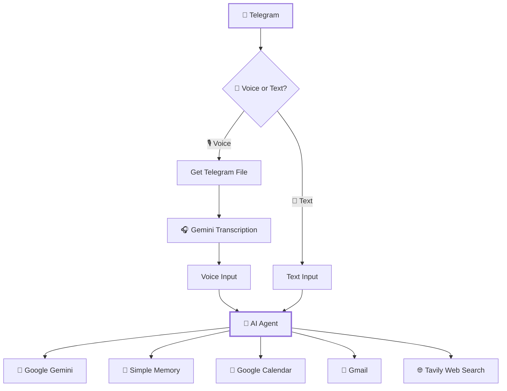

# 🤖 AI Personal Assistant

<p align="center">
  
</p>

<p align="center">
  <strong>A personal AI assistant built with n8n, Google Gemini, Telegram, Gmail, Google Calendar, and Tavily.</strong>
</p>

<p align="center">
  
  
  
  
</p>

---

## ✨ Overview

This project is an **AI-powered personal assistant** built with **n8n**.

It provides a single conversational interface through Telegram and can understand both **text and voice input**. The AI Agent can use connected tools to manage calendar events, send emails, and perform web research.

### 🎯 What it can do

- 💬 Understand text messages
- 🎙️ Process voice messages
- 🧠 Maintain conversational memory
- 📅 Create and manage Google Calendar events
- 📧 Draft and send Gmail messages
- 🌐 Search the web using Tavily
- 🤖 Use Google Gemini as the AI model
- ⚡ Automate the entire workflow with n8n

---

## 🏗️ Architecture



---

## 🚀 Features

### 🎙️ Voice + Text Input

The assistant accepts both Telegram text messages and voice messages.

Voice messages are:

```text
Telegram Voice
      ↓
Get File
      ↓
Gemini Transcription
      ↓
AI Agent
```

Text messages go directly into the AI Agent.

Both branches are normalized into a common `chatInput` field before reaching the agent.

---

### 🧠 AI Agent + Memory

The AI Agent uses **Google Gemini** for natural-language understanding and reasoning.

A **Simple Memory** node maintains conversational context so the assistant can understand follow-up requests.

Example:

```text
User: Schedule a meeting tomorrow at 10 AM.

Assistant: What should I call the meeting and how long should it last?

User: Project discussion, one hour.

Assistant: ...
```

---

### 📅 Google Calendar

The assistant can work with Google Calendar for:

- Creating events
- Checking availability
- Updating events
- Cancelling/deleting events
- Resolving relative dates such as "today" and "tomorrow"

Calendar actions are designed to verify availability before creating or moving an event.

---

### 📧 Gmail

The assistant can:

- Draft emails
- Generate subjects
- Format email content as HTML
- Send emails through Gmail

---

### 🌐 Web Research with Tavily

The assistant uses an n8n **HTTP Request** tool connected to the **Tavily Search API**.

It can be used for:

- Latest information
- News research
- Current developments
- Web research
- Information that may have changed recently

```text
User request
     ↓
AI Agent
     ↓
HTTP Request
     ↓
Tavily Search API
     ↓
Search results
     ↓
AI Agent
     ↓
Telegram response
```

---

## 🛠️ Tech Stack

| Technology | Purpose |
|---|---|
| **n8n** | Workflow automation |
| **Google Gemini** | AI model & voice transcription |
| **Telegram** | User interface |
| **Google Calendar** | Calendar management |
| **Gmail** | Email automation |
| **Tavily** | Web search |
| **Simple Memory** | Conversation memory |
| **ngrok** | Local webhook exposure |

---

## 🔄 Workflow

```text
                    ┌─────────────────┐
                    │    Telegram     │
                    └────────┬────────┘
                             │
                       ┌─────▼─────┐
                       │   Switch  │
                       └─────┬─────┘
                         ┌───┴───┐
                         │       │
                       Voice    Text
                         │       │
                         ▼       │
                  ┌────────────┐ │
                  │ Get a File │ │
                  └─────┬──────┘ │
                        ▼        │
                  ┌────────────┐ │
                  │   Gemini   │ │
                  │Transcribe  │ │
                  └─────┬──────┘ │
                        │        │
                        └───┬────┘
                            ▼
                    ┌──────────────┐
                    │  AI Agent    │
                    └──────┬───────┘
                           │
              ┌────────────┼────────────┐
              ▼            ▼            ▼
         🧠 Gemini    📅 Calendar    📧 Gmail
                           │
                           ▼
                     🌐 Tavily
```

---

## 📸 Project Screenshot

The screenshot below shows the project in action:

<p align="center">
  
</p>

> **Note:** Keep `my personal assistant.png` in the same folder as this `README.md`, or update the image path above to match your repository structure.

---

## ⚙️ Setup

### 1. Install n8n

Set up a self-hosted n8n instance.

### 2. Create the required credentials

Connect:

- Telegram Bot
- Google Gemini
- Google Calendar
- Gmail
- Tavily API

### 3. Import the workflow

Import your n8n workflow into your instance.

### 4. Configure environment-specific settings

Update:

- Telegram credentials
- Google OAuth credentials
- Tavily API key
- Calendar permissions
- Memory/session configuration
- Webhook/ngrok configuration

### 5. Test the workflow

Send a message through Telegram and verify:

```text
Telegram
   ↓
n8n
   ↓
AI Agent
   ↓
Tool
   ↓
Result
   ↓
Telegram
```

---

## 🔐 Security

Never commit API keys, OAuth secrets, passwords, or private credentials to GitHub.

Use:

```text
.env
environment variables
n8n credentials
GitHub Secrets
```

and add sensitive files to `.gitignore`.

Example:

```gitignore
.env
*.key
credentials.json
```

---

## 🎯 Project Goal

The goal of this project is to explore how multiple AI and automation services can be combined into a single personal assistant.

Instead of interacting with separate applications for email, calendar, conversations, and web research, the user can interact with one AI assistant through Telegram.

---

## 🔮 Future Improvements

- 🔊 Text-to-speech responses
- 🗂️ Persistent external memory
- 🧑‍💼 Multiple user support
- 📊 Task and productivity tracking
- 🔔 Scheduled reminders
- 🧩 Additional business automation tools
- 🖥️ Web-based dashboard
- 🔐 Improved authentication and access control

---

## 📌 Project Status

**Status:** 🚧 Active Development

This project is continuously being improved as new AI tools, integrations, and automation capabilities are added.

---

## 👨‍💻 Author

**Vishnu S.R.**

Building practical AI automation systems with **n8n, AI agents, APIs, and modern AI tools**.

---

<p align="center">
  ⭐ If you find this project interesting, consider giving it a star!
</p>
